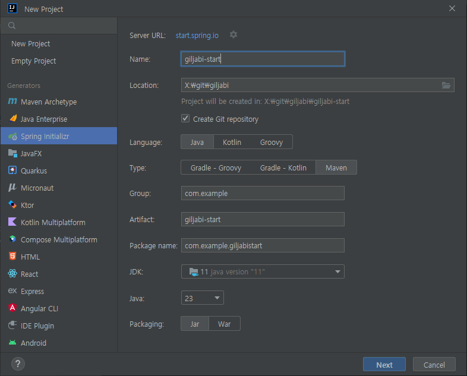
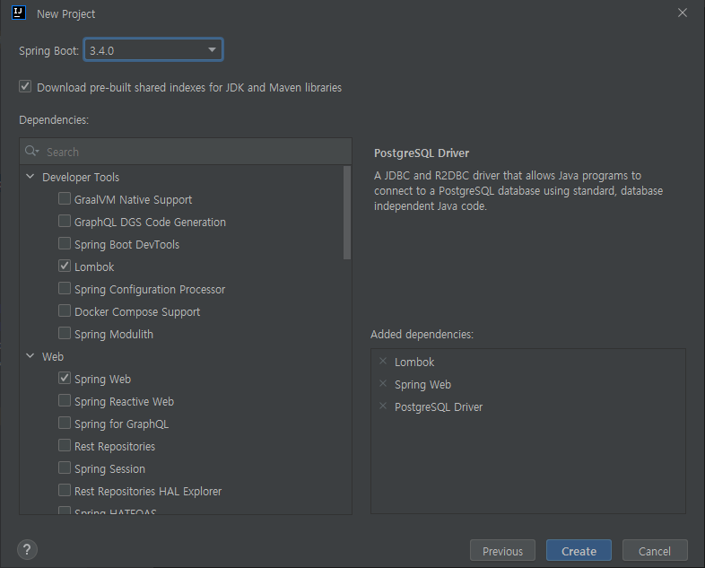
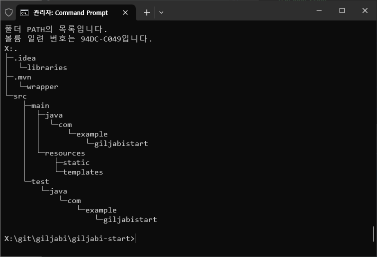
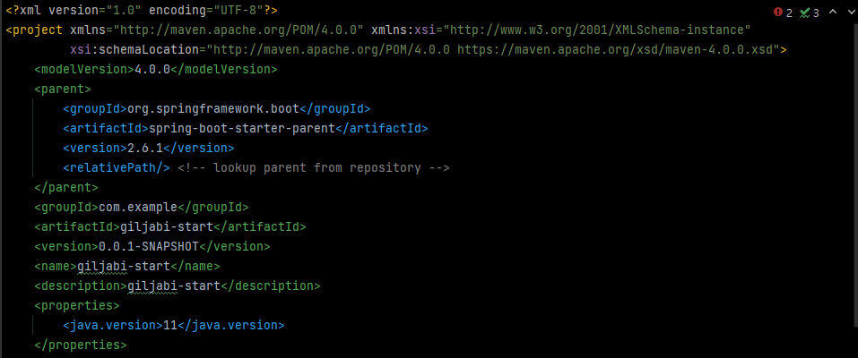
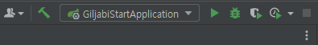
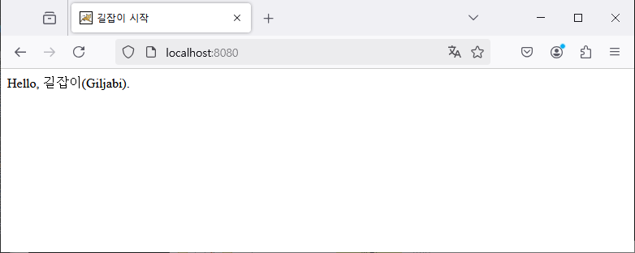
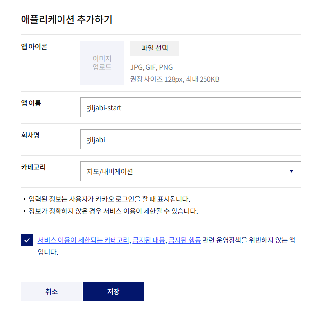
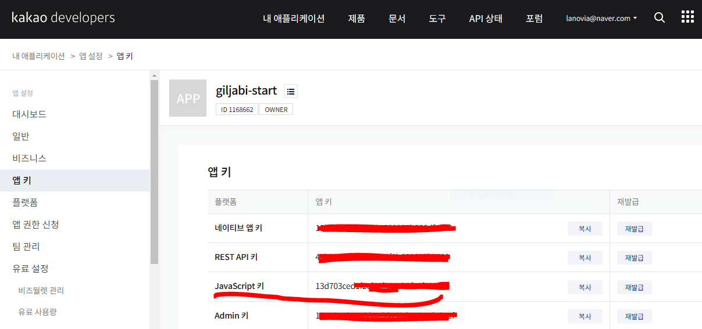
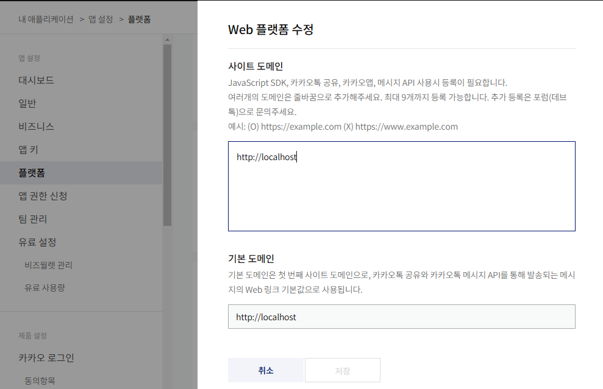
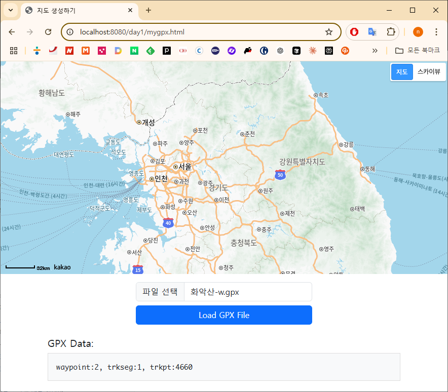

# 길잡이 시작하기...

1. Project 만들기
2. 카카오맵 API key
3. 카카오맵 올리기
4. gpx파일 구조
5. gpx파일을 지도에 올리기
6. gpx파일 저장하기
7. waypoint...


## 1. Project 만들기
### 1.1 기본 프로젝트 설정
* giljabi 프로젝트는 spring boot 2.6.x를 사용합니다. 하지만 Spring boot 프로젝트는 항상 최신 버전으로 만들기 때문에 버전은 프로젝트 생성 후 변경할 예정이므로 기본값으로 나오는 버전을 선택합니다.
* lombok, Spring web(tomcat), DB(postgresql)





### 1.2 디렉토리 구조



* docs: 각종 문서 및 그림파일들, 필요시 생성
* src: source 파일
* pom.xml:  POM(Project Object Model)은 Apache Maven에서 사용하는 XML 형식의 프로젝트 설정 파일
* README.md: 프로젝트 설명 문서 

### 1.3 pom.xml 수정
* JDK: 11
* Spring boot: 2.6.1
* 현재 사용하지 않는 부분은 삭제하고 위 2개만 수정하고 "maven project reload"합니다.




### 1.4 index.html 작성
* src/main/resources/static/index.html 작성
```html
<!DOCTYPE html>
<html lang="en">
<head>
    <meta charset="UTF-8">
    <title>길잡이 시작</title>
</head>
<body>
Hello, Giljabi.
</body>
</html>
```

### 1.5 WAS 실행확인





```text
...
2024-12-02 09:54:53.015  INFO 65404 --- [           main] o.s.b.a.w.s.WelcomePageHandlerMapping    : Adding welcome page: class path resource [static/index.html]
2024-12-02 09:54:53.091  INFO 65404 --- [           main] o.s.b.w.embedded.tomcat.TomcatWebServer  : Tomcat started on port(s): 8080 (http) with context path ''
2024-12-02 09:54:53.101  INFO 65404 --- [           main] c.e.g.GiljabiStartApplication            : Started GiljabiStartApplication in 1.499 seconds (JVM running for 4.492)
```

## 2. 카카오맵 API key
### 2.1 애플리케이션 추가
* https://developers.kakao.com/console/app




### 2.2 앱 키 
* 앱선택 후 왼쪽에 "앱 키"를 보면 키가 생성되어 있음을 볼 수 있습니다. 웹에서 사용하는 것은 "JavaScript키"입니다.




### 2.3 플랫폼 등록
* 앱키 아래에 있는 "플랫폼"을 등록해야 사용할 수 있습니다.
* "웹플랫폼 등록"을 합니다. 우리가 사용하는 웹플랫폼에서 접속하는 도메인은 localhost(127.0.0.1)입니다.
* 여기에 등록된 도메인서만 앱키를 사용해서 접속 할 수 있습니다.

* 


## 3. 카카오맵에 gpx 올리기
### 3.1 웹화면
* 카카오맵을 사용하려면 javascript에 앱키를 넣어서 사용하며, jquery를 함께 사용합니다.
* src/main/resources/static/mygpx.html
* gpx 파일업로드를 위해 bootstr파일, 버튼을 반응형에 맞게
```html
<!DOCTYPE html>
<html lang="ko">
<head>
    <meta charset="utf-8">
    <title>지도 생성하기</title>
    <script type="text/javascript" src="//dapi.kakao.com/v2/maps/sdk.js?appkey=your_appkey"></script>
    <script src="https://cdn.jsdelivr.net/npm/bootstrap@5.3.0/dist/js/bootstrap.bundle.min.js"></script>
    <link href="https://cdn.jsdelivr.net/npm/bootstrap@5.3.0/dist/css/bootstrap.min.css" rel="stylesheet">
    <script src="https://code.jquery.com/jquery-3.3.1.min.js"></script>
    <link href="/css/mygpx.css" rel="stylesheet">
    <script type="text/javascript" src="/js/mygpx.js"></script>
</head>
<body>
<div id="map"></div>
<div class="container text-center mt-3">
    <input type="file" class="form-control w-50 mx-auto" id="fileUpload" accept=".gpx" />
    <button class="btn btn-primary mt-2 w-50" id="loadButton">Load GPX File</button>
</div>

<!-- GPX Data Output -->
<div class="container mt-4">
    <h5>GPX Data:</h5>
    <pre id="gpxOutput" style="background: #f8f9fa; padding: 1rem; border: 1px solid #ddd;"></pre>
</div>
</body>
</html>
```

* src/main/resources/static/js/mygpx.js mygpx.html에서 사용할 javascript를 함께 작성합니다.
```javascript

let gMap;

function initMap() {
    let mapContainer = document.getElementById('map');
    let mapOption = {
        center: new kakao.maps.LatLng(37.56683546665817, 126.9786607449023),	//지도의 중심위치
        level: 12
    };
    gMap = new kakao.maps.Map(mapContainer, mapOption);
    gMap.addControl(new kakao.maps.MapTypeControl(), kakao.maps.ControlPosition.TOPRIGHT);
}


function clickGpxLoadButton() {
    $('#loadButton').on('click', function () {
        const file = $('#fileUpload')[0].files[0];

        if (!file) {
            alert('Please select a GPX file first.');
            return;
        }

        const reader = new FileReader();
        reader.onload = function (event) {
            const fileContent = event.target.result;
            const parser = new DOMParser();
            const xmlDoc = parser.parseFromString(fileContent, "application/xml");
            const waypoints = xmlDoc.getElementsByTagName("wpt");
            const trkseg = xmlDoc.getElementsByTagName("trkseg");
            const trkpt = xmlDoc.getElementsByTagName("trkpt");

            $('#gpxOutput').text(`waypoint:${waypoints.length}, 
            trkseg:${trkseg.length}, trkpt:${trkpt.length}`);
        };
        reader.readAsText(file);
    });
}

$(document).ready(function () {
    initMap();
    clickGpxLoadButton();
});
```

* src/main/resources/static/css/mygpx.css
```css
html, body {
    height: 100%; /* 부모 요소의 높이를 명시적으로 설정 */
    width: 100%; /* 부모 요소의 높이를 명시적으로 설정 */
    margin: 0; /* 기본 여백 제거 */
}

#map {
    height: 70%; /* 부모 요소를 기준으로 100% 설정 */
    width: 100%; /* 화면 너비 전체 */
    background-color: lightblue;
}
```




### 3.2 gpx 오브젝트